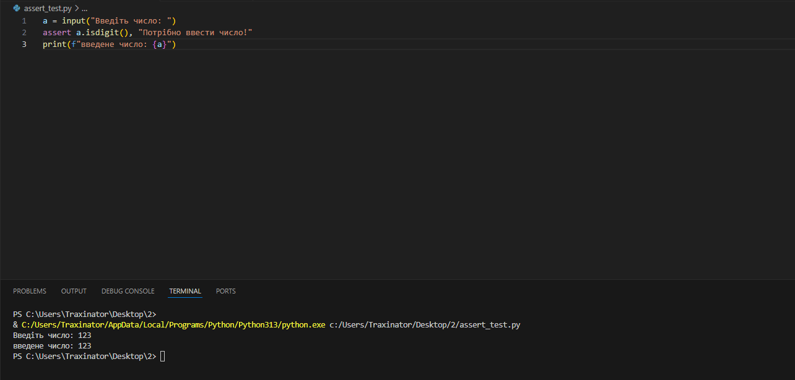
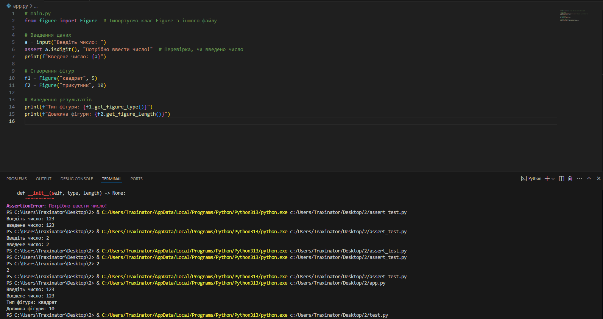
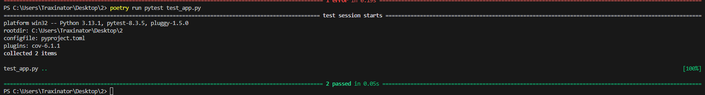
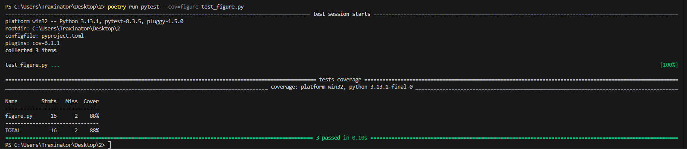
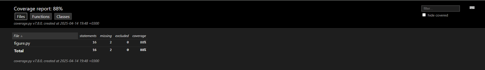

# Звіт до роботи з тестування

## Тема: Тестування програмного коду

## Мета роботи: Навчитися використовувати різні методи тестування Python-коду, включаючи assert, unittest, pytest та аналіз покриття коду.

## Виконання роботи

### 1. Перевірка assert

Створено файл `figure_assert.py` з класом Figure, який використовує assert для валідації вхідних даних:

```python
class Figure:
    def __init__(self, type, length) -> None:
        assert length > 0, "Довжина має бути більшою за 0!"
        assert type in ["квадрат", "прямокутник", "трикутник"], "Недопустимий тип фігури"
        self.type = type
        self.length = length
```



**Результати тестування:**
- При спробі створити фігуру з від'ємною довжиною отримуємо помилку
- При спробі створити недозволену фігуру отримуємо помилку

### 2. Юніт-тестування з unittest

Створено тестовий файл `test.py`:

```python
import unittest
from figure import Figure

class TestFigure(unittest.TestCase):
    def test_figure_type(self):
        f = Figure("квадрат", 5)
        self.assertEqual(f.get_figure_type(), "квадрат")
    
    def test_figure_length(self):
        f = Figure("трикутник", 10)
        self.assertEqual(f.get_figure_length(), 10)
```



### 3. Тестування з pytest

Виконано тестування з pytest:

```bash
poetry run pytest --cov-figure test_figure.py
```



### 4. Аналіз покриття коду


**Результати:**
- Загальне покриття коду: 88%
- Покриття файлу figure.py: 16 функцій, 2 пропущено

## Висновок

1. У роботі було реалізовано різні методи тестування
2. Мета роботи досягнута
3. Отримано практичні навички роботи з тестами
4. Всі завдання виконано успішно
5. Формат здачі зручний та наочний

Скріни розміщені у відповідних розділах, де вони ілюструють результати виконання конкретних завдань. Кожен скріншот супроводжується поясненням, що на ньому відображено.****
